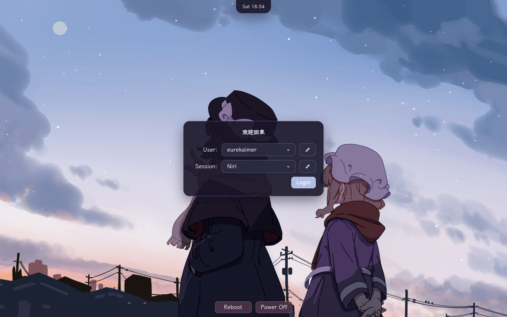

# EurekaimerOS

[中文说明](README_zh-CN.md)

A personal, host-aware NixOS configuration built around Niri, Noctalia, Home Manager, and flakes. `/etc/nixos` is the live configuration; this repository is its long-lived, frequently synchronized source copy.

Repository: [github.com/Eurekaimer/EurekaimerOS](https://github.com/Eurekaimer/EurekaimerOS)


The ReGreet login screen and the Hyprlock lock screen share the same wallpaper and greeting text:




## Choose a topic

+ [Configuration architecture](docs/architecture.md)
  + Flake inputs and package flow
  + Host, system, and Home Manager boundaries
  + Safe extension points
+ [System configuration](docs/system.md)
  + Boot, network, locale, LXGW fonts, graphics, and desktop services
  + TLP power policy, storage, gaming, and virtualization
+ [Desktop and UI](docs/desktop.md)
  + Niri session, screenshots, and window rules
  + Noctalia, GTK, icons, core user tools, and optional UI modules
+ [Applications](docs/applications.md)
  + Chrome and Throne as the declared browsers
  + Documents, media, communication, transfer, and MIME defaults
  + Links crediting each major upstream project
+ [Development environment](docs/development.md)
  + Editors, CLI tools, language toolchains, notebooks, and AI tools
+ [Build and maintenance](docs/operations.md)
  + Rebuild and verification commands
  + Recovery, migration, power diagnostics, and EurekaimerOS synchronization
+ [Complete documentation index](docs/index.md)
  + English and Chinese navigation for every section

## Repository map

```text
flake.nix
├── inputs
│   ├── nixpkgs
│   ├── nixpkgs-unstable
│   ├── home-manager
│   ├── noctalia
│   ├── komari-call
│   ├── lexigraph
│   └── hot100-assistant
└── nixosConfigurations.nixos
    ├── hosts/nixos/configuration.nix
    │   ├── hardware-configuration.nix
    │   ├── host-local.nix
    │   ├── proxy-local.nix
    │   ├── modules/system/system.nix
    │   ├── modules/system/software.nix
    │   └── modules/system/graphics-intel.nix
    └── home-manager.users.eurekaimer
        └── home/eurekaimer/home.nix
            ├── modules/home/desktop.nix
            ├── modules/home/core.nix
            ├── modules/home/development.nix
            ├── modules/home/applications.nix
            └── modules/home/software.nix

docs/
├── index.md / index_zh-CN.md
└── <topic>.md / <topic>_zh-CN.md
```

+ [`flake.nix`](flake.nix)
  + Pins stable and unstable package sets and builds `nixosConfigurations.nixos`.
+ [`hosts/nixos/`](hosts/nixos/)
  + Current machine's hardware, local, and proxy entry points.
+ [`modules/system/`](modules/system/)
  + Root-owned NixOS services, hardware, power, fonts, virtualization, and shared packages.
+ [`home/eurekaimer/`](home/eurekaimer/)
  + Home Manager user entry point.
+ [`modules/home/`](modules/home/)
  + Desktop, user configuration, applications, and development tools.
+ [`docs/`](docs/)
  + Bilingual explanations of this repository's own configuration.

## Rebuild

+ Validate without activation:

```bash
nix build .#nixosConfigurations.nixos.config.system.build.toplevel --no-link
```

+ Build and switch the running system:

```bash
sudo nixos-rebuild switch --flake .#nixos
```

+ Install a clone into `/etc/nixos` with hardware regenerated for the current machine:

```bash
./deploy.sh
```

## Current decisions

+ UI and terminal text use LXGW WenKai Screen; code keeps a true monospace fallback.
+ Google Chrome and Throne are the browsers; Firefox and its outdated desktop rule were removed.
+ TLP owns power profiles. A small controller samples the battery every minute and adjusts the 90%/50%/20% tiers, aiming for six hours at the current full-charge capacity; idle sessions use suspend-then-hibernate.
+ Stable packages by default. Only fast-moving applications draw from the single `pkgs-unstable` instance in `flake.nix`.
+ Docker is enabled with Compose support and pulls images through the local proxy.
+ Disk UUIDs, proxy settings, and hardware configuration are machine-specific — review them before using this setup on another host.
