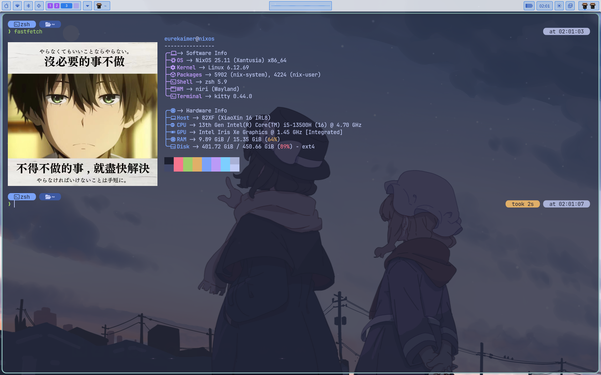

# EurekaimerOS

Language: English | [中文说明](README_zh-CN.md)

A personal NixOS configuration built around **Niri**, **Noctalia**, **Home Manager**, and **flakes**.



## Highlights

- Niri-based Wayland desktop workflow
- Noctalia shell components
- Declarative system and user environment
- Reusable module layout with host-specific files separated
- QEMU/KVM virtualization with virt-manager for Windows virtual machines

## Recovery Notes

For reinstalling or recovering this setup, keep the early path simple:

1. In the live ISO, add a Nix binary cache mirror to `/etc/nix/nix.conf`.
2. Install a minimal working system first, using the GUI installer if convenient.
3. After the first boot, add the mirror again in the installed system.
4. Restore network/proxy access and GitHub access. Prefer `throne` or `nekoray` early; use `mihomo` directly if a headless core is enough.
5. Fetch this repository and run the rebuild command.

This avoids making the initial install depend on a proxy GUI, browser login, or a fully working desktop session.

In the live ISO, rebuild `/etc/nix/nix.conf` as a normal file and add mirrors:

```bash
sudo cp -L /etc/nix/nix.conf /etc/nix/nix.conf.bak
sudo rm /etc/nix/nix.conf
sudo tee /etc/nix/nix.conf >/dev/null <<'EOF'
experimental-features = nix-command flakes
substituters = https://mirrors.ustc.edu.cn/nix-channels/store https://cache.nixos.org/
EOF
sudo systemctl restart nix-daemon
```

The configured system currently prefers domestic mirrors in `modules/system/base.nix`. If a mirror is stale or incomplete, switch mirrors temporarily and rebuild again.

## Layout

```text
flake.nix
│   ├── nixpkgs              stable system package set
│   ├── nixpkgs-unstable     source for selected fast-moving packages
│   ├── home-manager
│   ├── noctalia             follows nixpkgs-unstable
│   ├── lexigraph            follows nixpkgs-unstable
│   └── llm-agents
├── pkgs-unstable            imported once here and passed to modules
└── nixosConfigurations.nixos
    ├── hosts/nixos/configuration.nix
    │   ├── hardware-configuration.nix
    │   ├── host-local.nix
    │   ├── proxy-local.nix
    │   ├── ../../modules/system/system.nix
    │   └── ../../modules/system/graphics-intel.nix
    └── home-manager.users.eurekaimer
        └── home/eurekaimer/home.nix
            ├── ../../modules/home/desktop.nix
            ├── ../../modules/home/core.nix
            ├── ../../modules/home/development.nix
            │   ├── development/neovim.nix
            │   └── development/toolchain.nix
            │       └── development/toolchain/*.nix
            └── ../../modules/home/applications.nix
                ├── applications/*.nix
                └── applications/mime-defaults.nix
```

Key files:

- `flake.nix`
- `hosts/nixos/configuration.nix`
- `home/eurekaimer/home.nix`
- `modules/home/development/toolchain.nix`
- `modules/home/development/toolchain/*.nix`
- `modules/home/applications/mime-defaults.nix`
- `modules/system/packages/*.nix`
- `modules/system/virtualisation.nix`
- `home-layer-map.txt`
- `system-layer-map.txt`

`nixpkgs-unstable` is configured only in `flake.nix`, where it is imported as
`pkgs-unstable` and passed to both NixOS modules and Home Manager modules. If a
module needs an unstable package, accept `pkgs-unstable` as a module argument and
annotate the package usage locally; do not import `inputs.nixpkgs-unstable`
again inside the module.

## QEMU/KVM Virtualisation

- `modules/system/virtualisation.nix` enables libvirt/QEMU/KVM, virt-manager, swtpm, SPICE USB redirection, `virt-viewer`, and `virtio-win` for Windows guests.
- `modules/system/users.nix` adds `eurekaimer` to `libvirtd` and `kvm`; log out and back in after rebuilding so the new groups apply.
- `systemd.services.virtchd.enable = false` avoids pulling cloud-hypervisor when the mirror is incomplete; QEMU/libvirt Windows VMs do not need virtchd.


## Rebuild

```bash
sudo nixos-rebuild switch --flake .#nixos
```

## Niri Screenshots And OBS

Screenshots are handled by niri so window captures use real window objects,
including rounded corners, shadows, and transparent space outside the window.
Noctalia keeps its shell, panel, notification, and launcher roles.

| Shortcut | Action |
| --- | --- |
| `Print` | Screenshot the focused monitor, save to `~/Pictures/Screenshots/`, and copy to the clipboard. |
| `Alt+Print` | Screenshot the focused window with transparent outside area. |
| `Mod+Alt+Print` | Pick a window with the mouse, then screenshot that window. |
| `Shift+Print` | Open niri's region screenshot UI. |

These bindings have `hotkey-overlay-title` entries, so they show in niri's
`Mod+Shift+Slash` help overlay.

The `niri-window-shot` helper is generated declaratively from
`modules/home/desktop/niri.nix`. To test it temporarily inside niri:

```bash
niri-window-shot
```

To confirm the last screenshot reached the clipboard:

```bash
wl-paste --type image/png >/tmp/niri-shot.png
```

Some image viewers render transparent pixels as black, white, or a checkerboard;
the PNG transparency is still preserved. OBS is installed from
`nixpkgs-unstable` with PipeWire audio capture, VAAPI, and multi-RTMP plugins.

## R And Notebook Support

R is provided through Nix wrappers. The development toolchain includes R Markdown, common statistics packages, plotting packages, Jupyter, and a declarative `R (Nix)` kernel.

After rebuilding:

```bash
jupyter kernelspec list
```

The list should include `r-nix`.

## Python And uv

Python project environments are managed by `uv`. The global Home Manager
configuration installs `uv`, `jupyter`, and `pyright`, but does not pin
`UV_PYTHON` globally. This lets project-local `.python-version` files drive
interpreter selection and allows uv-managed Python downloads when the requested
version is not already installed.

## Troubleshooting Notes

- `hardware-configuration.nix` is machine-specific and should be regenerated per host.
- Host-local and proxy settings may need adjustment on a new machine.
- During early recovery, prefer `throne`, `nekoray`, or `mihomo`; `clash-verge-rev` depends on WebView and is better used after the full desktop environment is stable.
- Steam may show a black UI under Niri/Xwayland. `modules/system/gaming.nix` currently works around this with `-cef-disable-gpu-compositing`.
- `httpgd` is not enabled while it is marked broken in the current nixpkgs revision.

## Notes

- For another host, add a separate `hosts/<name>/` entry instead of reusing machine-specific files blindly.
- Keep personal data, homework files, and local test paths out of the public README.
