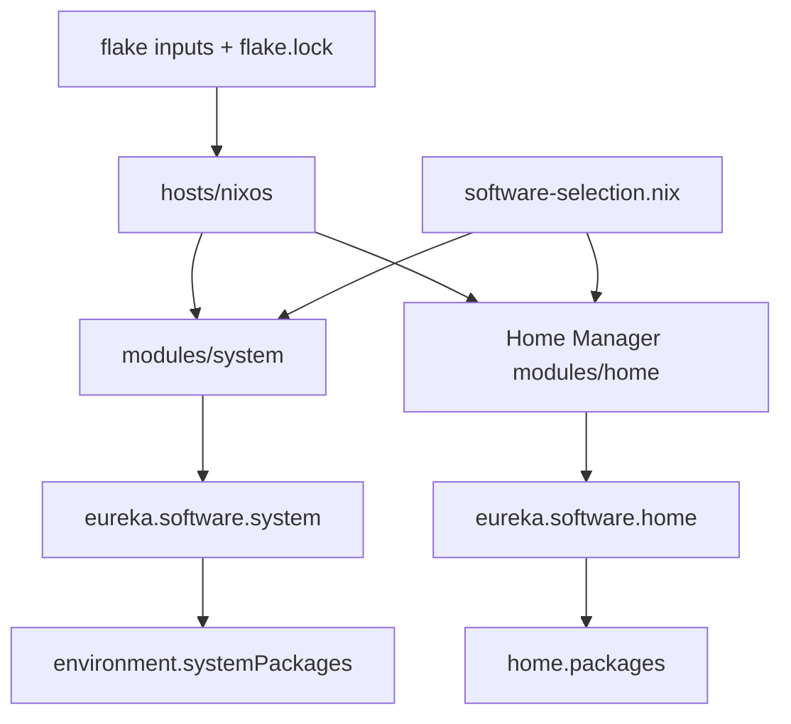

# Configuration Architecture

## Evaluation flow

+ [`flake.nix`](../flake.nix)
  + Pins NixOS 25.11, unstable nixpkgs, Home Manager, Noctalia, Komari Call, Lexigraph, and the non-flake Hot100 source.
  + Imports unstable once as `pkgs-unstable` and passes it to NixOS and Home Manager modules through special arguments.
  + Reads `hosts/nixos/settings.nix` and `software-selection.nix`, then passes the same host values and package choices to both module systems.
  + Exposes one host, currently `x86_64-linux`, as `nixosConfigurations.nixos`.
+ [`hosts/nixos/configuration.nix`](../hosts/nixos/configuration.nix)
  + Combines hardware (`hardware-configuration.nix` + `hardware-extra.nix`), host-local/proxy files, and the shared system module.
  + Hardware, local, and proxy files are machine-specific and must be reviewed before reuse.
+ [`modules/system/system.nix`](../modules/system/system.nix)
  + Aggregates base, users, locale, desktop, power, graphics, mounts, gaming, virtualization, and system packages.
  + Keeps those responsibility boundaries and only skips unselected modules at aggregator entry points.
  + Keeps `power.nix` as the category entry and delegates TLP, adaptive control, thermal, sleep, and diagnostics to `modules/system/power/`.
+ [`home/eurekaimer/home.nix`](../home/eurekaimer/home.nix)
  + Defines the Home Manager user and imports desktop, core, development, and application groups.
  + Imports `modules/home/personal.nix` separately so owner commands do not leak into generic shell or application modules.
  + Disables Home Manager fontconfig because the system module owns the complete font configuration.

## Responsibility boundaries

+ `modules/system/`
  + Root-owned services, boot, hardware, kernel settings, global fonts, and shared packages.
  + Small shared CLI commands are split into categories under `modules/system/packages/`.
+ `modules/home/`
  + User applications, XDG files, desktop behavior, editors, and language tools.
  + `modules/home/config/` holds real configuration directories that Home Manager maps to `~/.config`.
+ `hosts/nixos/`
  + `settings.nix` centralizes user identity, locale, compatibility baselines, and personal-module defaults.
  + `host-local.nix`, `hardware-configuration.nix`, `hardware-extra.nix`, and `proxy-local.nix` preserve the owner's verified machine/network values.
  + `software-selection.nix` is host choice data; it does not implement packages.

## Generic and personal modules

+ `modules/system/personal.nix` connects owner-specific flake modules such as Lexigraph and Komari Call.
+ `modules/home/personal/` holds commands with campus URLs or personal directory conventions, including campus-login and docker-ass.
+ Generic `applications`, `core`, and `development` modules do not know about these workflows.
+ See [Personal modules](personal.md) for dependencies and extension rules.

## Package policy

+ Stable `pkgs` is the default for the operating system and most applications.
+ `pkgs-unstable` is limited to software that needs faster updates, including Noctalia, OBS/mpv, selected communication clients, and editors.
+ Modules accept `pkgs-unstable` as an argument and never import unstable nixpkgs again.

## Extension points

+ Add a host under `hosts/<name>/` and a matching `nixosConfigurations.<name>` output.
+ Use `deploy-owner.sh` for an exact restoration of the committed owner machine. Use [`scripts/deploy-full.sh`](../scripts/deploy-full.sh) on another machine; it regenerates hardware and applies portable host/proxy defaults, while GPU extras must be selected explicitly with `generate-hardware.sh`. `deploy-preserve-hardware.sh` keeps the target's existing host files.
+ Use [`scripts/select-software.sh`](../scripts/select-software.sh) to choose modules at the existing category boundaries; see [Software selection](software-selection.md).
+ Add a root-owned feature under `modules/system/` and import it from `system.nix`.
+ Add a user application to the appropriate `modules/home/applications/` category.
+ Add a language as a separate `modules/home/development/toolchain/` module; if it has VSCode extensions, add a conditional group in `editors.nix` using the same selection key.

## Upstream

+ [NixOS](https://nixos.org/)
+ [Nix flakes](https://nix.dev/concepts/flakes.html)
+ [Home Manager](https://github.com/nix-community/home-manager)

[中文版](architecture_zh-CN.md)
