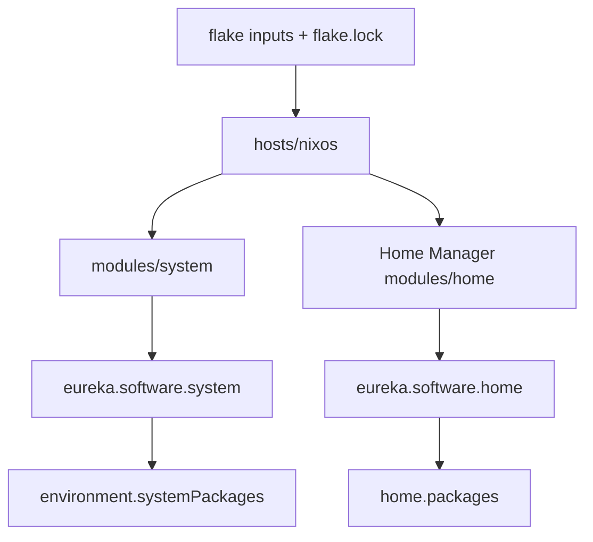

# Configuration Architecture

## Evaluation flow

+ [`flake.nix`](../flake.nix)
  + Pins NixOS 25.11, unstable nixpkgs, Home Manager, Noctalia, Komari Call, Lexigraph, and the non-flake Hot100 source.
  + Imports unstable once as `pkgs-unstable` and passes it to NixOS and Home Manager modules through special arguments.
  + Exposes one `x86_64-linux` host: `nixosConfigurations.nixos`.
+ [`hosts/nixos/configuration.nix`](../hosts/nixos/configuration.nix)
  + Combines hardware (`hardware-configuration.nix` + `hardware-extra.nix`), host-local/proxy files, the shared system module, and Lexigraph.
  + Hardware, local, and proxy files are machine-specific and must be reviewed before reuse.
+ [`modules/system/system.nix`](../modules/system/system.nix)
  + Aggregates base, users, locale, desktop, power, graphics, mounts, gaming, virtualization, and system packages.
+ [`home/eurekaimer/home.nix`](../home/eurekaimer/home.nix)
  + Defines the Home Manager user and imports desktop, core, development, and application groups.
  + Disables Home Manager fontconfig because the system module owns the complete font configuration.

## Responsibility boundaries

+ `modules/system/`
  + Root-owned services, boot, hardware, kernel settings, global fonts, and shared packages.
  + Small shared CLI commands are split into categories under `modules/system/packages/`.
+ `modules/home/`
  + User applications, XDG files, desktop behavior, editors, and language tools.
  + `modules/home/config/` holds real configuration directories that Home Manager maps to `~/.config`.
+ `hosts/nixos/`
  + Values tied to this machine or network.

## Package policy

+ Stable `pkgs` is the default for the operating system and most applications.
+ `pkgs-unstable` is limited to software that needs faster updates, including Noctalia, OBS/mpv, selected communication clients, and editors.
+ Modules accept `pkgs-unstable` as an argument and never import unstable nixpkgs again.

## Extension points

+ Add a host under `hosts/<name>/` and a matching `nixosConfigurations.<name>` output.
+ Use [`scripts/deploy-full.sh`](../scripts/deploy-full.sh) from an external clone on a new machine (regenerates hardware, applies portable host/proxy defaults, detects GPU vendor); `deploy-preserve-hardware.sh` redeploys keeping the target's hardware and host files; the `deploy-*.sh` partial scripts push single areas.
+ Add a root-owned feature under `modules/system/` and import it from `system.nix`.
+ Add a user application to the appropriate `modules/home/applications/` category.
+ Add a language as a separate `modules/home/development/toolchain/` module.

## Upstream

+ [NixOS](https://nixos.org/)
+ [Nix flakes](https://nix.dev/concepts/flakes.html)
+ [Home Manager](https://github.com/nix-community/home-manager)

[中文版](architecture_zh-CN.md)
