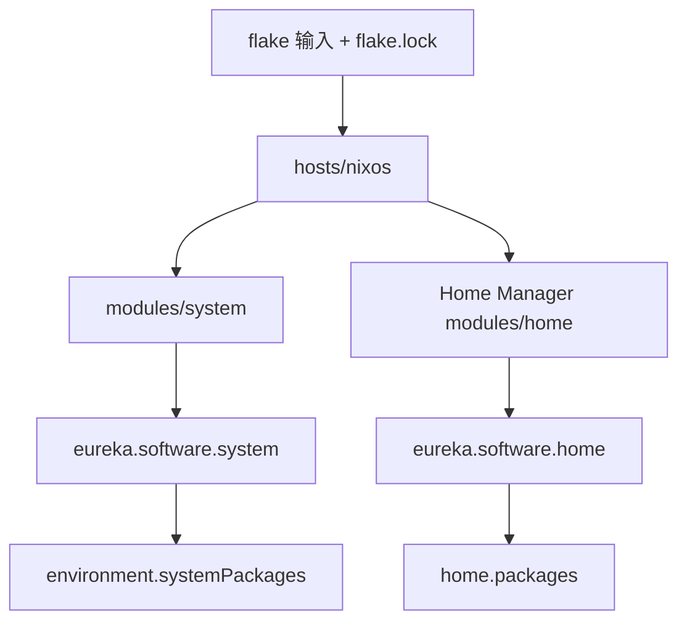

# 配置架构

## 配置流向

+ [`flake.nix`](../flake.nix)
  + 固定 `nixpkgs` 25.11、`nixpkgs-unstable`、Home Manager、Noctalia、Komari Call、Lexigraph，以及非 flake 的 Hot100 源码输入。
  + 只在这里导入一次 `nixpkgs-unstable`，生成 `pkgs-unstable`。
  + 将 `pkgs-unstable` 同时通过 `specialArgs` 和 `home-manager.extraSpecialArgs` 传给下层模块。
  + 只导出一台 `x86_64-linux` 主机：`nixosConfigurations.nixos`。
+ [`hosts/nixos/configuration.nix`](../hosts/nixos/configuration.nix)
  + 主机入口，组合硬件（hardware-configuration.nix + hardware-extra.nix）、主机本地参数、代理、通用系统模块和 Lexigraph。
  + `hardware-configuration.nix`、`host-local.nix`、`proxy-local.nix` 都属于机器或网络相关配置，不应直接复制到另一台机器。
+ [`modules/system/system.nix`](../modules/system/system.nix)
  + 聚合系统级模块：基础设施、用户、区域、桌面、电源、图形、挂载、游戏、虚拟化和系统软件包。
  + 系统模块负责服务、驱动、启动过程、字体缓存和所有用户共享的软件。
+ [`home/eurekaimer/home.nix`](../home/eurekaimer/home.nix)
  + Home Manager 用户入口，固定用户名、主目录和 `home.stateVersion`。
  + 聚合桌面、核心工具、开发环境和日常应用。
  + 关闭 Home Manager 自己的 fontconfig，避免与系统层字体 XML 重复。

## 模块边界

+ 系统层 `modules/system/`
  + 需要 root、systemd 系统服务、硬件、内核或全局字体时放在这里。
  + 小型通用命令按用途拆到 `modules/system/packages/`。
+ 用户层 `modules/home/`
  + 用户软件、XDG 配置、桌面快捷键、编辑器和语言工具链放在这里。
  + `config/` 保存由 Home Manager 映射到 `~/.config` 的真实配置目录。
+ 主机层 `hosts/nixos/`
  + 只保存这一台设备独有的信息，例如硬件扫描结果、磁盘或代理参数。

## 软件包版本约定

+ 默认使用稳定版 `pkgs`。
  + 系统基础和大部分应用跟随 NixOS 25.11，减少整体更新风险。
+ 只对确实需要新版本的软件使用 `pkgs-unstable`。
  + 当前包括 Noctalia、OBS、mpv、部分通信软件和编辑器。
  + 模块只接收 `pkgs-unstable` 参数，禁止再次导入 unstable nixpkgs，避免同一配置出现多套不一致实例。

## 扩展方法

+ 新增主机
  + 新建 `hosts/<name>/`，保留独立硬件配置，并在 `flake.nix` 增加对应 `nixosConfigurations.<name>`。
+ 新机器从外部克隆运行 [`scripts/deploy-full.sh`](../scripts/deploy-full.sh)：重建硬件模块、套用可移植主机/代理默认值并探测 GPU 厂商；`deploy-preserve-hardware.sh` 保留目标机硬件与主机文件重新部署；`deploy-*.sh` 局部脚本只推送单一区域。
+ 新增系统功能
  + 在 `modules/system/` 新建单一职责模块，再从 `system.nix` 导入。
+ 新增用户应用
  + 按类别加入 `modules/home/applications/`，并从 `applications.nix` 导入。
+ 新增语言工具链
  + 放入 `modules/home/development/toolchain/`，并从 `toolchain.nix` 导入。

## 上游项目

+ [NixOS](https://nixos.org/)
+ [Nix flakes](https://nix.dev/concepts/flakes.html)
+ [Home Manager](https://github.com/nix-community/home-manager)
